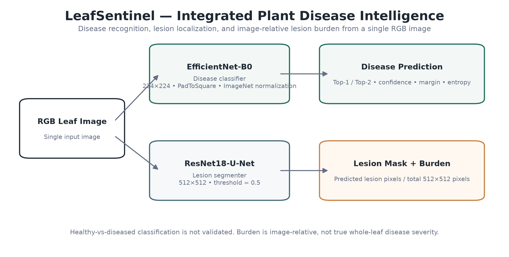
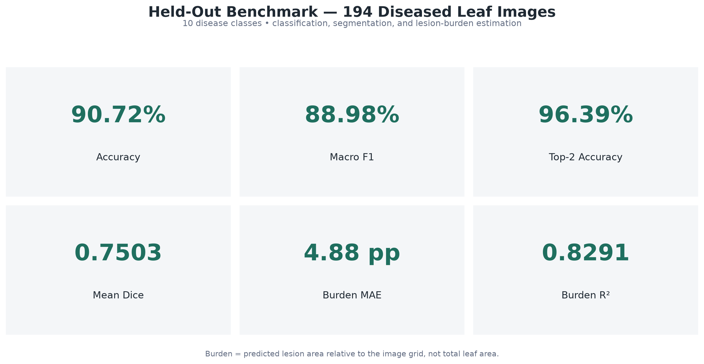
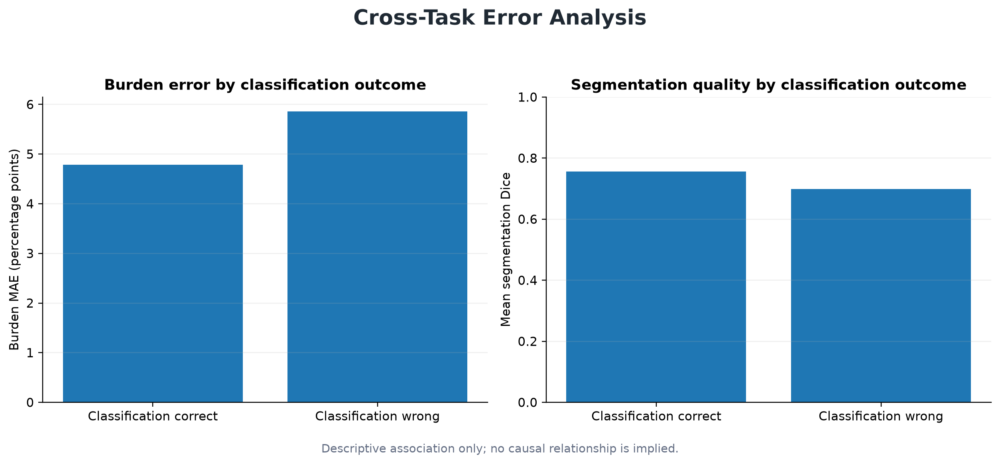

# LeafSentinel

**A leakage-aware computer vision system for plant disease recognition, lesion segmentation, and image-relative lesion burden estimation from RGB leaf images.**

LeafSentinel combines three complementary capabilities in one inference pipeline: disease classification, lesion localization, and lesion-area quantification. The system is built on a carefully audited subset of PlantSeg with duplicate-aware splitting to reduce train/test leakage.

<p align="center">
  
</p>

## Key Results

Evaluation on **194 diseased held-out test images across 10 disease classes** produced:

| Task | Metric | Result |
|---|---:|---:|
| Disease classification | Accuracy | **90.72%** |
| Disease classification | Macro F1 | **88.98%** |
| Disease classification | Top-2 Accuracy | **96.39%** |
| Lesion segmentation | Mean Dice | **0.7503** |
| Lesion segmentation | Mean IoU | **0.6279** |
| Lesion segmentation | Precision | **0.7721** |
| Lesion segmentation | Recall | **0.7894** |
| Image-relative lesion burden | MAE | **4.88 percentage points** |
| Image-relative lesion burden | RMSE | **0.0864** |
| Image-relative lesion burden | R² | **0.8291** |
| Image-relative lesion burden | Pearson | **0.9126** |
| Image-relative lesion burden | Spearman | **0.9041** |

<p align="center">
  
</p>

## What the System Does

Given a single RGB leaf image, LeafSentinel produces:

- a predicted disease class,
- Top-1 and Top-2 confidence scores,
- a lesion probability map,
- a binary lesion mask,
- image-relative lesion burden,
- confidence diagnostics such as margin and normalized entropy.

The classifier and segmenter use separate preprocessing pipelines so each model receives the same input representation used during training.

## Dataset Integrity and Benchmark Design

The source PlantSeg release contains **7,774 images**, representing **34 plant hosts** and **115 pathology categories**.

To reduce leakage risk, the data preparation pipeline performs:

- MD5-based exact duplicate detection,
- dHash-based near-duplicate candidate discovery,
- SSIM verification for candidate pairs,
- Union-Find grouping of connected duplicate samples,
- group-aware train/validation/test assignment.

The selected benchmark contains **1,304 samples** covering 10 disease classes plus 8 healthy controls.

| Crop | Disease | Samples |
|---|---|---:|
| Citrus | Citrus Canker | 323 |
| Grape | Downy Mildew | 211 |
| Soybean | Frogeye Leaf Spot | 153 |
| Tomato | Early Blight | 153 |
| Banana | Black Sigatoka | 114 |
| Potato | Late Blight | 78 |
| Corn | Gray Leaf Spot | 76 |
| Wheat | Leaf Rust | 75 |
| Apple | Black Rot | 63 |
| Bell Pepper | Bacterial Spot | 53 |
| Healthy controls | Mixed healthy foliage | 8 |

Healthy controls are not treated as a validated classification class because the available sample count is too small to support a meaningful healthy-vs-diseased benchmark.

## Disease Classification

**Model:** EfficientNet-B0  
**Input:** full RGB image, PadToSquare, 224×224  
**Classes:** 10 disease classes  
**Loss:** weighted cross-entropy

Held-out performance:

| Metric | Result |
|---|---:|
| Accuracy | **0.9072** |
| Balanced Accuracy | **0.8868** |
| Macro F1 | **0.8898** |
| Weighted F1 | **0.9065** |
| Top-2 Accuracy | **0.9639** |
| Mean Confidence | **0.9125** |

<p align="center">
  
</p>

## Lesion Segmentation

**Model:** ResNet18-U-Net  
**Input:** 512×512 RGB  
**Loss:** 0.5 BCEWithLogits + 0.5 Dice  
**Decision threshold:** 0.5

On the 194 diseased held-out images:

| Metric | Result |
|---|---:|
| Mean Dice | **0.7503** |
| Median Dice | **0.7904** |
| Mean IoU | **0.6279** |
| Mean Precision | **0.7721** |
| Mean Recall | **0.7894** |

## Image-Relative Lesion Burden

PlantSeg does not provide whole-leaf masks, so this project does **not** claim true disease severity.

The reported quantity is:

```text
Image-Relative Lesion Burden
= predicted lesion pixels / total image pixels
```

Two approaches were evaluated:

| Method | Test MAE | RMSE | R² | Pearson |
|---|---:|---:|---:|---:|
| Direct RGB regression | 0.1040 | 0.1483 | 0.4966 | 0.7353 |
| Segmentation-derived burden | **0.0513** | **0.0942** | **0.7970** | **0.8938** |

The segmentation-derived method is used as the primary burden estimate because it is substantially more accurate and spatially interpretable.

<p align="center">
  
</p>

## Integrated Inference

The production inference path is deliberately modular:

```text
RGB image
├── EfficientNet-B0
│   └── disease label + confidence + top-2 + margin + normalized entropy
│
└── ResNet18-U-Net
    └── lesion probability map
        └── binary mask
            └── image-relative lesion burden
```

The segmenter runs once per image, and the same mask is reused for visualization and burden measurement.

No arbitrary confidence threshold is applied by default. Confidence, margin, and entropy are reported as diagnostics rather than being presented as proof of image validity or healthy status.

## Cross-Task Findings

Across the held-out benchmark:

- **176 of 194** disease predictions were correct.
- Mean burden error was **4.78 percentage points** when classification was correct and **5.86 percentage points** when classification was wrong.
- Mean segmentation Dice was **0.7556** when classification was correct and **0.6985** when classification was wrong.
- Classification confidence was moderately associated with classification correctness (**Pearson = 0.571**).
- Classification confidence was essentially unrelated to burden absolute error (**Pearson = -0.014**).

These are descriptive associations only and do not imply causal relationships between the tasks.

<p align="center">
  
</p>

<p align="center">
  
</p>

## Supported Disease Classes

| Index | Class |
|---:|---|
| 0 | Apple — Black Rot |
| 1 | Banana — Black Sigatoka |
| 2 | Bell Pepper — Bacterial Spot |
| 3 | Citrus — Citrus Canker |
| 4 | Corn — Gray Leaf Spot |
| 5 | Grape — Downy Mildew |
| 6 | Potato — Late Blight |
| 7 | Soybean — Frogeye Leaf Spot |
| 8 | Tomato — Early Blight |
| 9 | Wheat — Leaf Rust |

## Repository Structure

```text
Leaf-Sentinel/
├── configs/
├── src/
│   ├── dataset/
│   ├── segmentation/
│   ├── classification/
│   ├── severity/
│   └── inference/
├── scripts/
├── results/
├── docs/
│   └── assets/
├── tests/
└── README.md
```

Large trained checkpoints are intentionally kept out of Git history and stored separately in the project artifact dataset:

```text
shazimjaved/leafsentinel-model-artifacts
```

## Generate Project Figures

The public-facing figures are generated from the tracked benchmark result files:

```bash
python scripts/generate_project_figures.py
```

Generated files:

```text
docs/assets/
├── system_overview.png
├── benchmark_summary.png
├── classification_confusion_matrix.png
├── burden_scatter.png
├── per_class_performance.png
└── cross_task_diagnostics.png
```

## Single-Image Inference

```bash
python scripts/run_inference.py \
  --config configs/inference.yaml \
  --image path/to/leaf.jpg \
  --classifier-checkpoint path/to/classifier.pth \
  --segmentation-checkpoint path/to/segmenter.pth \
  --class-map path/to/class_to_idx.json \
  --output-dir outputs/inference/sample
```

The command produces structured JSON output plus lesion-mask and overlay visualizations.

## Batch Inference

```bash
python scripts/run_batch_inference.py \
  --config configs/inference.yaml \
  --input-dir path/to/images \
  --classifier-checkpoint path/to/classifier.pth \
  --segmentation-checkpoint path/to/segmenter.pth \
  --class-map path/to/class_to_idx.json \
  --output-dir outputs/inference/batch
```

## Limitations

- The classifier is limited to the 10 supported disease classes.
- Healthy-vs-diseased classification is not validated.
- Image-relative lesion burden is not the same as percentage of total leaf area affected.
- Current benchmark results come from PlantSeg; robustness on uncontrolled field imagery and video has not yet been established.
- Classification, segmentation, and burden estimation are separate tasks, so no single combined “overall AI accuracy” is reported.

## Next Steps

Planned work includes real-world image evaluation, video inference, and a lightweight deployment interface.

## Reproducibility

The benchmark split is duplicate-aware and leakage-controlled. Classification, segmentation, and burden metrics are evaluated on aligned held-out samples so cross-task analysis is directly comparable.

Tracked metrics and predictions live under `results/`. Large model weights remain outside Git history in the project artifact dataset.

## Dataset Note

PlantSeg images retain their original source licenses. Consult the dataset metadata and source records before redistributing image content.
