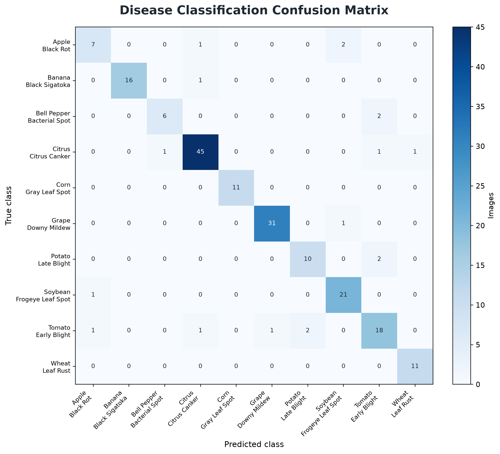
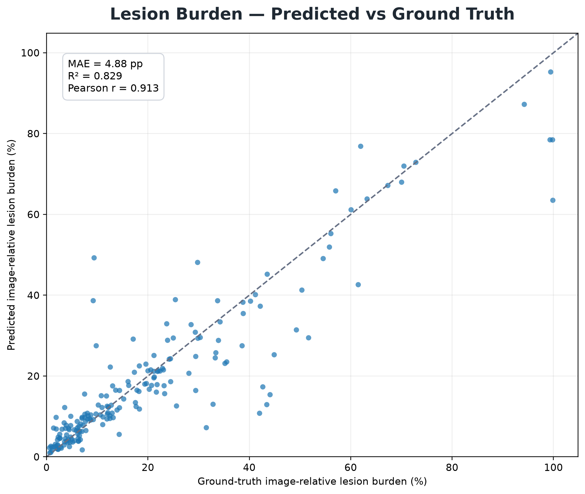
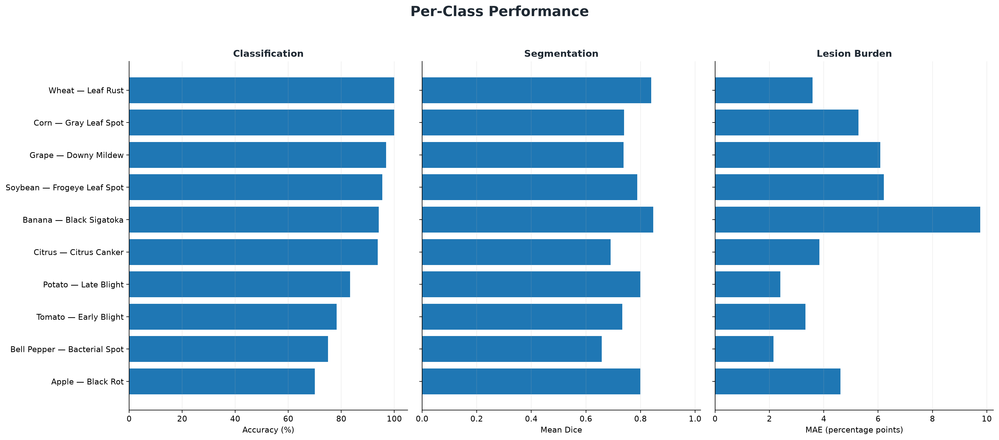

# LeafSentinel

**Leakage-aware plant disease classification, lesion segmentation, and image-relative lesion burden estimation from RGB leaf imagery.**

LeafSentinel is a multi-stage computer vision project built on the PlantSeg dataset. The project currently covers dataset auditing, leakage-controlled benchmark construction, lesion segmentation, 10-class disease classification, image-relative lesion burden estimation, and a unified multi-model inference system.

> **Current status:** Phases 1–5 complete. Real-world / video inference and deployment are planned as later phases.

<p align="center">
  
</p>

---

## Project Scope

LeafSentinel answers three separate questions from a leaf image:

- **WHAT disease is predicted?** — EfficientNet-B0 disease classifier.
- **WHERE are the visible lesions?** — ResNet18-U-Net lesion segmenter.
- **HOW MUCH of the image is lesion area?** — segmentation-derived image-relative lesion burden.

The integrated Phase 5 system combines those outputs into one structured inference result with disease probabilities, lesion mask, burden estimate, and confidence diagnostics.

**Important terminology:** PlantSeg does not provide whole-leaf masks. Therefore, LeafSentinel reports **Image-Relative Lesion Burden = lesion pixels / total image pixels**. It does **not** claim true whole-leaf disease severity or percentage of leaf area affected.

---

## Final Phase 5 Benchmark

The integrated benchmark uses **194 diseased held-out test images across 10 disease classes**. Healthy-vs-diseased classification is not validated and healthy controls are excluded from the primary Phase 5 benchmark.

<p align="center">
  
</p>

| Task | Metric | Result |
|---|---:|---:|
| Disease classification | Accuracy | **90.72%** |
| Disease classification | Macro F1 | **88.98%** |
| Disease classification | Top-2 Accuracy | **96.39%** |
| Lesion segmentation | Mean Dice | **0.7503** |
| Lesion segmentation | Mean IoU | **0.6279** |
| Lesion segmentation | Precision | **0.7721** |
| Lesion segmentation | Recall | **0.7894** |
| Image-relative lesion burden | MAE | **4.88 percentage points** |
| Image-relative lesion burden | RMSE | **0.0864** |
| Image-relative lesion burden | R² | **0.8291** |
| Image-relative lesion burden | Pearson | **0.9126** |
| Image-relative lesion burden | Spearman | **0.9041** |

---

## Benchmark Dataset & Leakage Control

The source PlantSeg release contains **7,774 images**, spanning **34 plant hosts** and **115 pathology classes**.

The benchmark preparation pipeline includes:

- exact duplicate detection using MD5,
- perceptual near-duplicate candidate detection using dHash,
- secondary SSIM verification,
- Union-Find duplicate grouping,
- group-aware split assignment so a duplicate group cannot span train / validation / test.

The selected benchmark contains **1,304 samples** across 10 disease classes plus 8 healthy controls.

| Crop | Disease | Samples |
|---|---|---:|
| Citrus | Citrus Canker | 323 |
| Grape | Downy Mildew | 211 |
| Soybean | Frogeye Leaf Spot | 153 |
| Tomato | Early Blight | 153 |
| Banana | Black Sigatoka | 114 |
| Potato | Late Blight | 78 |
| Corn | Gray Leaf Spot | 76 |
| Wheat | Leaf Rust | 75 |
| Apple | Black Rot | 63 |
| Bell Pepper | Bacterial Spot | 53 |
| Healthy controls | Mixed healthy foliage | 8 |

For disease classification, the 8 healthy controls are excluded because they are not sufficient to support a validated 11th class.

---

## Phase 2 — Lesion Segmentation

**Model:** ResNet18-U-Net  
**Input:** 512×512 RGB  
**Loss:** 0.5 BCEWithLogits + 0.5 Dice  
**Threshold:** 0.5

The recovered Phase 2 checkpoint was selected at **epoch 29**.

On the 194 diseased test images used by Phase 5:

| Metric | Result |
|---|---:|
| Mean Dice | **0.7503** |
| Median Dice | **0.7904** |
| Mean IoU | **0.6279** |
| Mean Precision | **0.7721** |
| Mean Recall | **0.7894** |

---

## Phase 3 — Disease Classification

**Model:** EfficientNet-B0  
**Input:** full RGB image, PadToSquare, 224×224  
**Classes:** 10 disease classes  
**Loss:** weighted cross-entropy

The verified Phase 3 checkpoint was selected at **epoch 19** with validation Macro F1 **0.9105**.

Held-out test results:

| Metric | Result |
|---|---:|
| Accuracy | **0.9072** |
| Balanced Accuracy | **0.8868** |
| Macro F1 | **0.8898** |
| Weighted F1 | **0.9065** |
| Top-2 Accuracy | **0.9639** |
| Mean Confidence | **0.9125** |

<p align="center">
  
</p>

---

## Phase 4 — Image-Relative Lesion Burden

Phase 4 compared two strategies:

1. **Direct RGB regression** with EfficientNet-B0.
2. **Segmentation-derived burden** from the Phase 2 binary lesion mask.

The segmentation-derived approach was clearly stronger and became the primary production method.

| Method | Test MAE | RMSE | R² | Pearson |
|---|---:|---:|---:|---:|
| Direct RGB regression | 0.1040 | 0.1483 | 0.4966 | 0.7353 |
| Segmentation-derived burden | **0.0513** | **0.0942** | **0.7970** | **0.8938** |

The direct regressor remains available only as an optional diagnostic. The Phase 5 system does not average the two estimates.

---

## Phase 5 — Integrated Multi-Model Inference

The final inference pipeline keeps classifier and segmenter preprocessing separate:

```text
RGB image
├── EfficientNet-B0
│   └── disease label + confidence + top-2 + margin + normalized entropy
│
└── ResNet18-U-Net
    └── lesion probability map
        └── binary mask @ 0.5
            └── image-relative lesion burden
```

The segmenter runs once per image. The same predicted mask is reused for visualization and burden calculation.

The system does not apply an arbitrary hard confidence threshold by default. Confidence, margin, and entropy are reported as diagnostics.

### Integrated Findings

Across the 194-image Phase 5 benchmark:

- **176 / 194** disease predictions were correct.
- Mean burden absolute error was **4.78 pp** when classification was correct and **5.86 pp** when classification was wrong.
- Mean segmentation Dice was **0.7556** when classification was correct and **0.6985** when classification was wrong.
- Classifier confidence was moderately associated with correctness (**Pearson = 0.571**).
- Classifier confidence was essentially unrelated to burden absolute error (**Pearson = -0.014**).

These are descriptive relationships and should not be interpreted as causal.

<p align="center">
  
</p>

<p align="center">
  
</p>

<p align="center">
  
</p>

---

## Supported Disease Classes

| Index | Class |
|---:|---|
| 0 | Apple — Black Rot |
| 1 | Banana — Black Sigatoka |
| 2 | Bell Pepper — Bacterial Spot |
| 3 | Citrus — Citrus Canker |
| 4 | Corn — Gray Leaf Spot |
| 5 | Grape — Downy Mildew |
| 6 | Potato — Late Blight |
| 7 | Soybean — Frogeye Leaf Spot |
| 8 | Tomato — Early Blight |
| 9 | Wheat — Leaf Rust |

---

## Repository Structure

```text
Leaf-Sentinel/
├── configs/
│   ├── segmentation.yaml
│   ├── classification.yaml
│   ├── severity.yaml
│   ├── inference.yaml
│   └── kaggle_*.yaml
│
├── src/
│   ├── dataset/          # audit, validation, leakage control
│   ├── segmentation/     # Phase 2 ResNet18-U-Net
│   ├── classification/   # Phase 3 EfficientNet-B0
│   ├── severity/         # Phase 4 burden regression / evaluation
│   └── inference/        # Phase 5 integrated inference engine
│
├── scripts/
│   ├── audit_dataset.py
│   ├── prepare_dataset.py
│   ├── train_segmentation.py
│   ├── evaluate_segmentation.py
│   ├── prepare_classification.py
│   ├── train_classifier.py
│   ├── evaluate_classifier.py
│   ├── evaluate_segmentation_burden.py
│   ├── run_inference.py
│   ├── run_batch_inference.py
│   └── generate_project_figures.py
│
├── results/
│   ├── phase2/
│   ├── phase3/
│   ├── phase4/
│   └── phase5/
│
├── docs/
│   └── assets/           # README / portfolio figures
│
├── tests/
└── README.md
```

Large model checkpoints are intentionally kept out of Git and versioned separately in the Kaggle artifact dataset:

```text
shazimjaved/leafsentinel-model-artifacts
```

---

## Generate Portfolio Figures

The README figures are generated directly from tracked Phase 5 result files, so no raw dataset or model checkpoint is required.

```bash
python scripts/generate_project_figures.py
```

This creates:

```text
docs/assets/
├── pipeline_overview.png
├── phase5_benchmark_summary.png
├── classification_confusion_matrix.png
├── burden_scatter.png
├── per_class_performance.png
└── integrated_diagnostics.png
```

---

## Single-Image Inference

```bash
python scripts/run_inference.py \
  --config configs/inference.yaml \
  --image path/to/leaf.jpg \
  --classifier-checkpoint path/to/phase3/best_model.pth \
  --segmentation-checkpoint path/to/phase2/best_model.pth \
  --class-map path/to/class_to_idx.json \
  --output-dir outputs/inference/sample
```

Outputs:

```text
result.json
mask.png
overlay.png
diagnostic_card.png
```

---

## Batch Inference

```bash
python scripts/run_batch_inference.py \
  --config configs/inference.yaml \
  --input-dir path/to/images \
  --classifier-checkpoint path/to/phase3/best_model.pth \
  --segmentation-checkpoint path/to/phase2/best_model.pth \
  --class-map path/to/class_to_idx.json \
  --output-dir outputs/inference/batch
```

Batch inference writes `predictions.csv`, `predictions.json`, and optional diagnostic visualizations while isolating per-image failures.

---

## Current Limitations

- The current classifier supports **10 disease classes**, not arbitrary plant diseases.
- **Healthy-vs-diseased classification is not validated** because healthy-control support is too small.
- Image-relative lesion burden is **not equivalent to true whole-leaf disease severity**.
- Phase 5 results are benchmark results from PlantSeg; real field/video robustness has not yet been established.
- No single combined “overall AI accuracy” score is reported because classification, segmentation, and burden estimation are distinct tasks.

---

## Roadmap

| Phase | Status | Scope |
|---|---|---|
| Phase 1 | ✅ Complete | Dataset audit, duplicates, leakage control |
| Phase 2 | ✅ Complete | Lesion segmentation |
| Phase 3 | ✅ Complete | 10-class disease classification |
| Phase 4 | ✅ Complete | Image-relative lesion burden |
| Phase 5 | ✅ Complete | Integrated multi-model inference |
| Phase 6 | ⏳ Next | Field / video / real-world inference |
| Phase 7 | ⏳ Planned | Deployment and portfolio application |

---

## Reproducibility Notes

The benchmark split is group-aware and leakage-controlled. Phase 5 uses the same held-out diseased test images for classifier, segmentation, and burden analysis so cross-task diagnostics are sample-aligned.

Tracked benchmark outputs live under `results/`. Large trained checkpoints are stored separately to avoid bloating Git history.

---

## License / Dataset Note

PlantSeg images retain their original source licenses. Refer to the dataset metadata and source records for image-level licensing information before redistributing dataset content.
